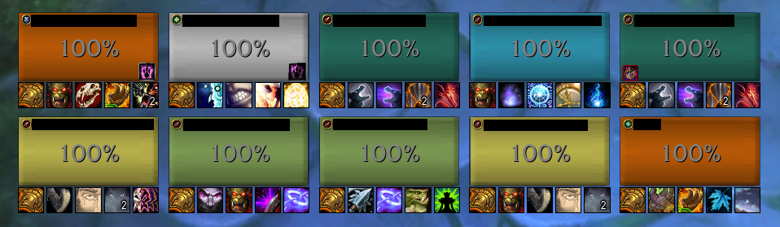
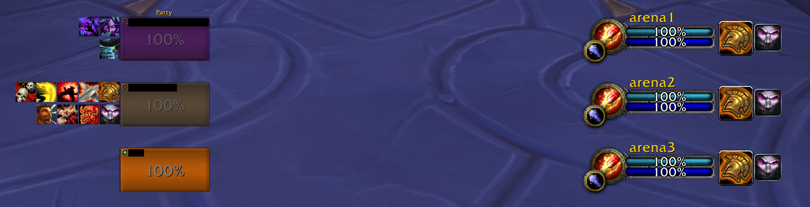
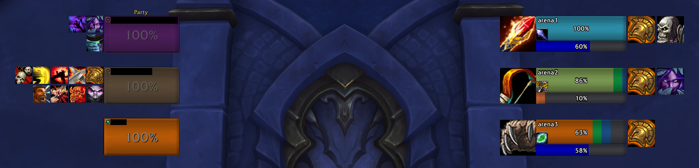
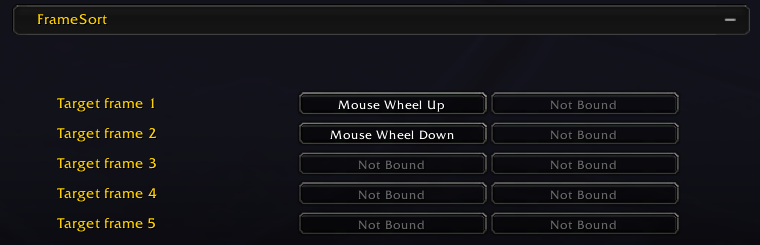
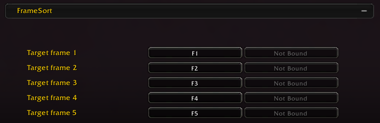

# FrameSort Tips #

Yo, I'm the developer of FrameSort.
I think most people just need party1/2 to be ordered properly but here are some other tips and tricks you can use FrameSort for.

## 1. Spacing ##

1. Add spacing to show OmniCD/ATT icons below frames (probably mostly useful for RBGs).



2. Spacing to make frames align with GladiusEx/sArena for symmetry.

sArena:



GladiusEx:



I didn't bother to make it pixel perfect, but you get the idea.

## 2. Macros ##

### Are you a ret paladin and your healer is feared/stunned? ###

```lua
#showtooltip
#FrameSort Healer
/cast [@healer] Blessing of Sanctuary
```

### Boomking wanting to innervate their healer with a fallback to their current target? ###

```lua
#showtooltip
#FrameSort Healer
/cast [@healer,exists][] Innervate
```

### Dispel your teammates without worrying if they are party1 or party2 ###

```lua
#FrameSort Frame1
/cast [@frame1] Dispel
```

```lua
#FrameSort Frame2
/cast [@frame2] Dispel
```

```lua
#FrameSort Frame3
/cast [@frame3] Dispel
```

### Target the same thing that your other DPS is targeting ###

```lua
#FrameSort DPS2
/assist [@dps2]
```

Note if you are in the bottom position you'd want to change this to "DPS1".

### Notes ###

- Need FrameSort version 5.1.0 (released today) or above for healer/tank/dps variables support.
- In the near future I plan on adding EnemyHealer and EnemyDPS macro variables.
- So you can do things like `/cast [@EnemyHealer] Storm Bolt` and get back to zugging.

## 3. Targeting ##

Stop caring about party1/party2/raid76 and just target frames based on their visual order.
This works in parties, raids, arena, in the world, everywhere; just target the damn box.



Or perhaps if you're a Mythic+ enjoyer:



## 4. Feedback ##

I'm just a random Aussie dude who works full-time, is addicted to WoW, and cares deeply about the ordering of coloured boxes on my screen.

If you encounter any bugs or have ideas for new features then feel free to let me know!
